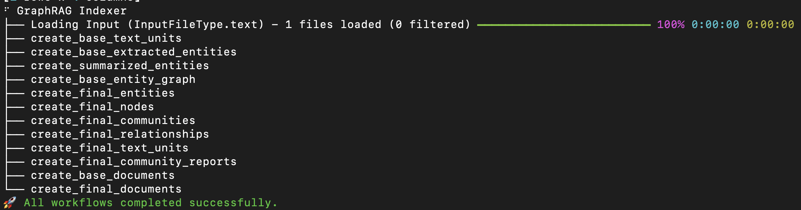
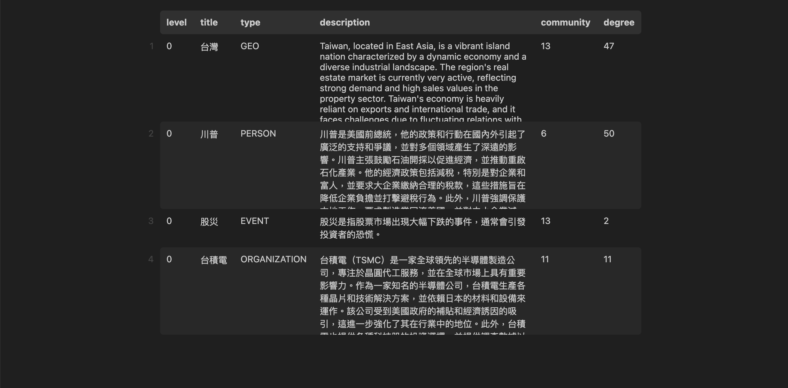
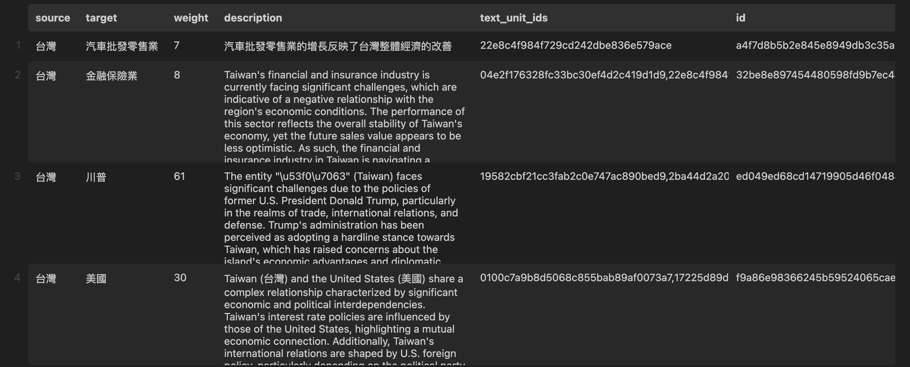
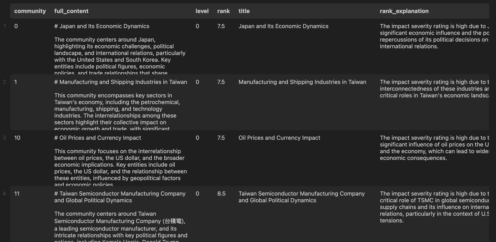
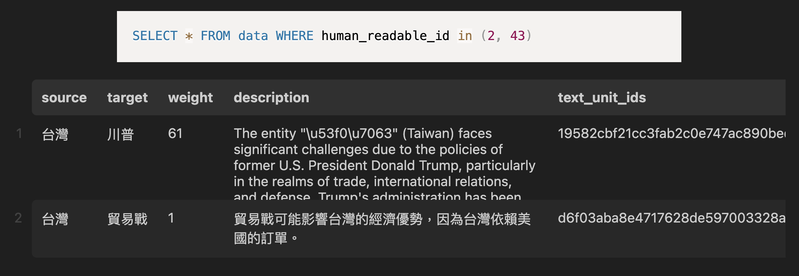
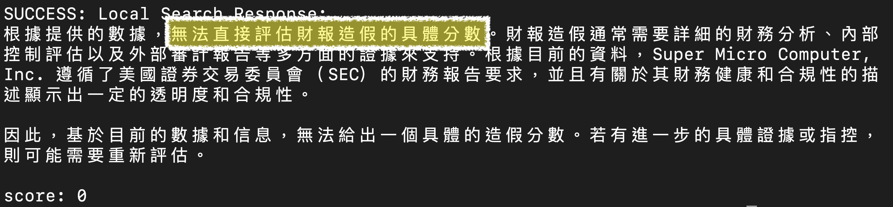
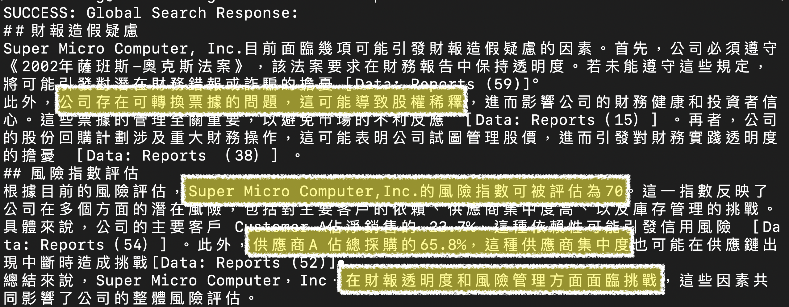
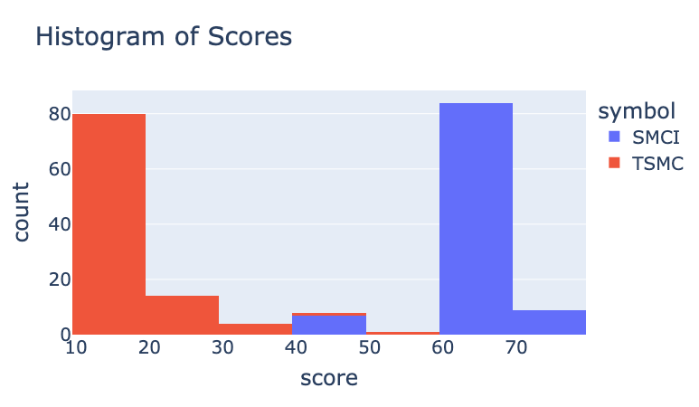
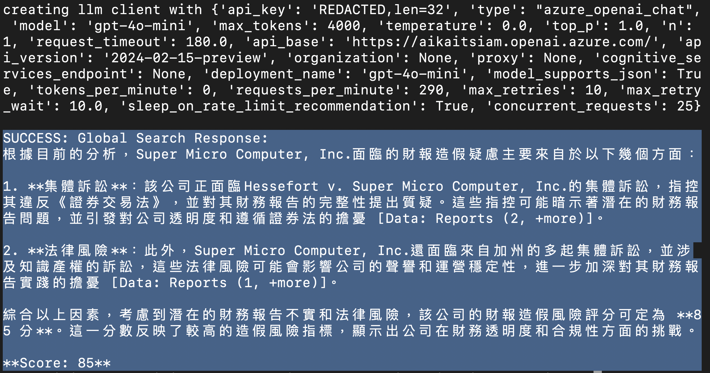

# 投資書僮進化中～GraphRAG！
 


2024/12/14 陳奎銘 Ben 


---

<!-- .slide: data-background-iframe="media/Ben.html" -->


----

因為太愛錢，所以只好一直講跟錢有關的 talk......

---

<!-- .slide: data-auto-animate -->
# Outline

- 投資書僮 2023 版與地雷
- RAG ⮕ GraphRAG
- GraphRAG 的使用說明與注意事項
- 投資書僮掃雷中

---

<!-- .slide: data-auto-animate -->
# 投資書僮 2023 版與地雷

- <font color='#646464'>RAG ⮕ GraphRAG </font>
- <font color='#646464'>GraphRAG 的使用說明與注意事項</font>
- <font color='#646464'>投資書僮掃雷中</font>


----

## 前情提要
- 去年利用 RAG 和線性回歸，看懂財報，作出投資策略
- 賺了一些～～


----


----

## 但是...

----


<!-- .slide: data-background-iframe="media/stock_percentage_change.html" -->

----


<!-- .slide: data-background="media/SMCI_news.png" -->


----

## RAG 的問題
- 利用 RAG 只能找出與問題最相近的片段
- RAG 沒有全局觀～
- 財報有問題也看不出來～

----


<!-- .slide: data-background="media/RAG_bot.png" -->

----


只好用 GraphRAG 來亡羊補牢了～

---


<!-- .slide: data-auto-animate -->
- <font color='#646464'>投資書僮 2023 版與地雷</font>
# RAG ⮕ `GraphRAG`
- <font color='#646464'>GraphRAG 的使用說明與注意事項</font>
- <font color='#646464'>投資書僮掃雷中</font>


----

# Retrival-Augmented Generation

----

<font color='#FF2D2D'>Retrival</font>-<font color='#66B3FF'>Augmented</font> <font color='#79FF79'>Generation</font>
## 透過<font color='#FF2D2D'>檢索</font><font color='#66B3FF'>加強</font><font color='#79FF79'>生成</font>答案的能力

##### ~~關鍵字搜尋~~<!-- .element: class="fragment" data-fragment-index="1" --> 
#### ⮕ 利用向量搜尋 <!-- .element: class="fragment" data-fragment-index="2" -->

----

<!-- .slide: data-background-iframe="media/RAG.html" -->


----

# GraphRAG

----

# `Knowledge` <font color='#FF2D2D'>`Graph`</font> + <font color='#66B3FF'>RAG</font>

- 文件 ⮕ 關係圖
    - 人、事、物 ⮕ Node (Entity)
    - 關係 ⮕ Edge (Relationship)
    - 小圈圈 ⮕ 很多 Node 群聚 (Community) 

----

<!-- .slide: data-background="media/graph_1.png" -->

----

<!-- .slide: data-background="media/graph_2.png" -->


----


<!-- .slide: data-background="media/community.png" -->

----

<!-- .slide: data-background="#999999" -->
GraphRAG Workflow From Microsoft


----

## GraphRAG Indexing




----

### Nodes



----


### Relationships




----


### Communities




----

## `Query`

----

<!-- .slide: data-background-iframe="media/global.html" -->


----


<!-- .slide: data-background-iframe="media/local.html" -->


----


<!-- .slide: data-background="media/global_search.png" -->

----


----

- The trade war initiated by Trump has had significant repercussions for Asian economies, particularly those reliant on exports to the U.S. Countries like Taiwan and South Korea are navigating the challenges posed by increased tariffs and trade restrictions, which threaten their economic stability and growth prospects. This situation highlights the interconnectedness of global trade and the impact of U.S. policies on regional economies. [Data: Relationships (43, 2)]


----

- 特朗普發起的貿易戰對亞洲經濟產生了顯著影響，特別是那些依賴對美國出口的國家。例如，台灣和韓國正努力應對加徵關稅和貿易限制帶來的挑戰，這些挑戰威脅到了它們的經濟穩定與增長前景。此情況突顯了全球貿易的相互依存性以及美國政策對區域經濟的影響。 [Data：Relationships (43, 2)]

----





----


<!-- .slide: data-background="media/local_search.png" -->


---


<!-- .slide: data-auto-animate -->
- <font color='#646464'>投資書僮 2023 版與地雷</font>
- <font color='#646464'>RAG ⮕ GraphRAG </font>
# GraphRAG 的使用說明與注意事項
- <font color='#646464'>投資書僮掃雷中</font>


----

## 安裝  `graphrag`


```
pip install graphrag
```
- from: https://github.com/microsoft/graphrag
- 最新版本 v0.9.0
- 目前最愛 v0.3.6


----

## 起手式

- 
```
mkdir -p 你的資料夾/input
```
- 將文本(.txt or .csv) 放入 `你的資料夾/input`
- 初始化

```
python -m graphrag.index --init --root ./你的資料夾
```
⬇
```[1, 4]
├── .env
├── input
├── prompts
└── settings.yaml
```

----

## 設定 .env

```
GRAPHRAG_API_KEY="LLM 服務的 KEY"
```


----

## 設定 setting

- 選擇可以負擔的模型
- 注意使用限制


```yaml [3,5-10|11-20|27,33]
encoding_model: cl100k_base
skip_workflows: []
llm:
  api_key: ${GRAPHRAG_API_KEY}
  type: azure_openai_chat # or openai_chat
  model: gpt-4o-mini
  model_supports_json: true # recommended if this is available for your model.
  api_base: https://XXXXXX.openai.azure.com/
  api_version: 2024-02-15-preview
  deployment_name: gpt-4o-mini
  tokens_per_minute: 12000 # set a leaky bucket throttle
  requests_per_minute: 290 # set a leaky bucket throttle
  max_retries: 10
  max_retry_wait: 10
  sleep_on_rate_limit_recommendation: true # whether to sleep when azure suggests wait-times
  # organization: <organization_id>
  # concurrent_requests: 25 # the number of parallel inflight requests that may be made
  # max_tokens: 4000
  # request_timeout: 180.0

parallelization:
  stagger: 0.3
  # num_threads: 50 # the number of threads to use for parallel processing

async_mode: threaded # or asyncio

embeddings:
  ## parallelization: override the global parallelization settings for embeddings
  async_mode: threaded # or asyncio
  llm:
    api_key: ${GRAPHRAG_API_KEY}
    type: azure_openai_embedding # or azure_openai_embedding
    model: text-embedding-3-small
    api_base: https://aikaitsiam.openai.azure.com/
    api_version: 2024-02-15-preview
    # organization: <organization_id>
    deployment_name: text-embedding-3-small
    # tokens_per_minute: 150_000 # set a leaky bucket throttle
    requests_per_minute: 290 # set a leaky bucket throttle
    max_retries: 10
    max_retry_wait: 10
    sleep_on_rate_limit_recommendation: true # whether to sleep when azure suggests wait-times
    # concurrent_requests: 25 # the number of parallel inflight requests that may be made
    # batch_size: 16 # the number of documents to send in a single request
    # batch_max_tokens: 8191 # the maximum number of tokens to send in a single request
    # target: required # or optional
  


chunks:
  size: 300
  overlap: 100
  group_by_columns: [id] # by default, we don't allow chunks to cross documents
    
input:
  type: file # or blob
  file_type: text # or csv
  base_dir: "input"
  file_encoding: utf-8
  file_pattern: ".*\\.txt$"

cache:
  type: file # or blob
  base_dir: "cache"
  # connection_string: <azure_blob_storage_connection_string>
  # container_name: <azure_blob_storage_container_name>

storage:
  type: file # or blob
  base_dir: "output/${timestamp}/artifacts"
  # connection_string: <azure_blob_storage_connection_string>
  # container_name: <azure_blob_storage_container_name>

reporting:
  type: file # or console, blob
  base_dir: "output/${timestamp}/reports"
  # connection_string: <azure_blob_storage_connection_string>
  # container_name: <azure_blob_storage_container_name>

entity_extraction:
  ## llm: override the global llm settings for this task
  ## parallelization: override the global parallelization settings for this task
  ## async_mode: override the global async_mode settings for this task
  prompt: "prompts/entity_extraction.txt"
  entity_types: [organization,person,geo,event]
  max_gleanings: 0

summarize_descriptions:
  ## llm: override the global llm settings for this task
  ## parallelization: override the global parallelization settings for this task
  ## async_mode: override the global async_mode settings for this task
  prompt: "prompts/summarize_descriptions.txt"
  max_length: 500

claim_extraction:
  ## llm: override the global llm settings for this task
  ## parallelization: override the global parallelization settings for this task
  ## async_mode: override the global async_mode settings for this task
  # enabled: true
  prompt: "prompts/claim_extraction.txt"
  description: "Any claims or facts that could be relevant to information discovery."
  max_gleanings: 0

community_report:
  ## llm: override the global llm settings for this task
  ## parallelization: override the global parallelization settings for this task
  ## async_mode: override the global async_mode settings for this task
  prompt: "prompts/community_report.txt"
  max_length: 2000
  max_input_length: 8000

cluster_graph:
  max_cluster_size: 10

embed_graph:
  enabled: false # if true, will generate node2vec embeddings for nodes
  # num_walks: 10
  # walk_length: 40
  # window_size: 2
  # iterations: 3
  # random_seed: 597832

umap:
  enabled: false # if true, will generate UMAP embeddings for nodes

snapshots:
  graphml: true
  raw_entities: false
  top_level_nodes: false

local_search:
  # text_unit_prop: 0.5
  # community_prop: 0.1
  # conversation_history_max_turns: 5
  # top_k_mapped_entities: 10
  # top_k_relationships: 10
  # max_tokens: 12000

global_search:
  # max_tokens: 12000
  # data_max_tokens: 12000
  # map_max_tokens: 1000
  # reduce_max_tokens: 2000
  # concurrency: 32

```


----

## 可自行修改 Prompt

```
├── prompts
│   ├── claim_extraction.txt
│   ├── community_report.txt
│   ├── entity_extraction.txt
│   └── summarize_descriptions.txt
└── settings.yaml
```
- 例如：要求用繁體中文
```
Return output in Traditional Chinese as a single list of all the entities and relationships
```

----

## 開始產生 `GraphRAG`

```bash
python -m graphrag.index --root ./你的資料夾
```
- 148 頁大約需要 4分22秒
- 40 頁大約需要 11 秒

----

## `Global\Local Search`

```bash
python3 -m graphrag.query --root ./你的資料夾 --method global "你的問題"
```
```bash
python3 -m graphrag.query --root ./你的資料夾 --method local "你的問題"
```

----

## 0.4.0 之後的版本

```bash
graphrag init --root ./ragtest
graphrag index --root ./ragtest
graphrag query --method local --query "你的問題" --root ./你的資料夾
graphrag query --method global --query "你的問題" --root ./你的資料夾
```

----

## 使用時機

- global: 
    - 需要全局觀的問題
    - There is nothing in the query to direct it to the correct information.
- local: 
    - 需要細節的問題
    - It is well-suited for answering questions that require an understanding of specific entities mentioned in the input documents

---


<!-- .slide: data-auto-animate -->
- <font color='#646464'>投資書僮 2023 版與地雷</font>
- <font color='#646464'>RAG ⮕ GraphRAG </font>
- <font color='#646464'>GraphRAG 的使用說明與注意事項</font>
# 投資書僮掃雷中

----

### SMCI 2024 Q3 財報

> 針對這份檔案，針 對財報造假的疑慮，是否可以給我一個分數，分數越高代表越有造假的跡象，滿分 100 分，沒 有造假情況給 0 分，直接告訴我分數，例如：score: xx"


----

## Local or Global?

----

## Local Search


- 結論：這題用 Local Search 無效

----

財報才不會說自己有問題

----


## Global Search




----

## 每份財報都被認為有問題？
- 測試材料
    - 台積電 TSMC 2024 Q2 財報
    - 美超微 SMCI 2024 Q3 財報
- 測試方式：Global Search 各 100 次


----

# SCMI vs. TSMC


----

## 最快何時可以發現？

----

## SMCI 2023 年報


----

# 成也 SMCI
# 敗也 SMCI

----


<!-- .slide: data-background="media/SMCI_history.png" -->

----

## 投資書僮補完計畫
- 針對每月被挑出的股票，用 GraphRAG 產出『財報造假』指數
- 指數超出 50 便應該考量是否該進場
- 若冒險進場，從高處下降 10% 以上，便直接出場

----

## 投影片


----

## `R-Ladies Taipei`


</img>

----

# Thank You